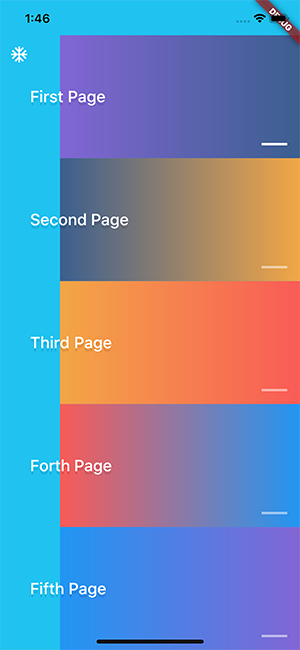
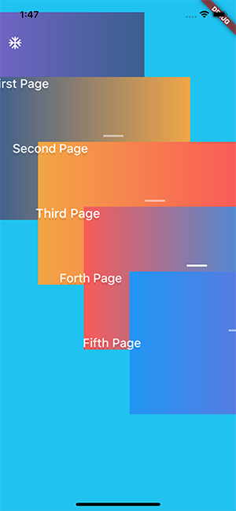

# flutter card navi

A card navigation extends from [Flutter official demo](https://github.com/flutter/flutter/tree/master/examples/flutter_gallery)

## Demo

| Home | transition | Page |
| --- | ------- | --- |
|  |  |  |

## Building

You can follow these instructions to build the gallery app
and install it onto your device.

### Prerequisites

If you are new to Flutter, please first follow
the [Flutter Setup](https://flutter.io/setup/) guide.

### Building and installing the Flutter app

* `cd $APP_ROOT`
* `flutter upgrade`
* `flutter run --release`

The `flutter run --release` command both builds and installs the Flutter app.
